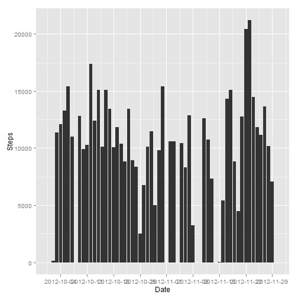
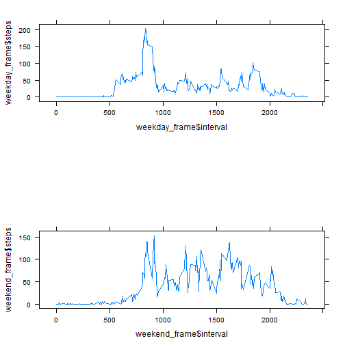

# Reproducible Research: Peer Assessment 1


## Loading and preprocessing the data

```r
data = read.csv("activity.csv")
```

```
## Warning: cannot open file 'activity.csv': No such file or directory
```

```
## Error: cannot open the connection
```

```r
head(data)
```

```
##   steps       date interval    days
## 1     0 2012-10-01        0 weekday
## 2     0 2012-10-01        5 weekday
## 3     0 2012-10-01       10 weekday
## 4     0 2012-10-01       15 weekday
## 5     0 2012-10-01       20 weekday
## 6     0 2012-10-01       25 weekday
```

```r
data_no_na = data[which(!is.na(data$steps)), ]
head(data_no_na)
```

```
##   steps       date interval    days
## 1     0 2012-10-01        0 weekday
## 2     0 2012-10-01        5 weekday
## 3     0 2012-10-01       10 weekday
## 4     0 2012-10-01       15 weekday
## 5     0 2012-10-01       20 weekday
## 6     0 2012-10-01       25 weekday
```

## What is mean total number of steps taken per day?


```r
ggplot(data_no_na, aes(as.Date(data_no_na$date), data_no_na$steps)) + geom_bar(stat = "identity") + 
    scale_x_date(breaks = "7 days", labels = date_format("%Y-%m-%d")) + xlab("Date") + 
    ylab("Steps")
```

 

```r
mean_date = data.frame(mean = sapply(unique(data_no_na$date), function(x) mean(data_no_na[which(data_no_na$date == 
    x), ]$steps)), date = unique(data_no_na$date))
summary(mean_date)
```

```
##       mean              date   
##  Min.   : 0.0   2012-10-01: 1  
##  1st Qu.:23.5   2012-10-02: 1  
##  Median :36.1   2012-10-03: 1  
##  Mean   :32.5   2012-10-04: 1  
##  3rd Qu.:44.5   2012-10-05: 1  
##  Max.   :73.6   2012-10-06: 1  
##                 (Other)   :55
```

```r
mean_date
```

```
##       mean       date
## 1   0.0000 2012-10-01
## 2   0.4375 2012-10-02
## 3  39.4167 2012-10-03
## 4  42.0694 2012-10-04
## 5  46.1597 2012-10-05
## 6  53.5417 2012-10-06
## 7  38.2465 2012-10-07
## 8   0.0000 2012-10-08
## 9  44.4826 2012-10-09
## 10 34.3750 2012-10-10
## 11 35.7778 2012-10-11
## 12 60.3542 2012-10-12
## 13 43.1458 2012-10-13
## 14 52.4236 2012-10-14
## 15 35.2049 2012-10-15
## 16 52.3750 2012-10-16
## 17 46.7083 2012-10-17
## 18 34.9167 2012-10-18
## 19 41.0729 2012-10-19
## 20 36.0938 2012-10-20
## 21 30.6285 2012-10-21
## 22 46.7361 2012-10-22
## 23 30.9653 2012-10-23
## 24 29.0104 2012-10-24
## 25  8.6528 2012-10-25
## 26 23.5347 2012-10-26
## 27 35.1354 2012-10-27
## 28 39.7847 2012-10-28
## 29 17.4236 2012-10-29
## 30 34.0938 2012-10-30
## 31 53.5208 2012-10-31
## 32  0.0000 2012-11-01
## 33 36.8056 2012-11-02
## 34 36.7049 2012-11-03
## 35  0.0000 2012-11-04
## 36 36.2465 2012-11-05
## 37 28.9375 2012-11-06
## 38 44.7326 2012-11-07
## 39 11.1771 2012-11-08
## 40  0.0000 2012-11-09
## 41  0.0000 2012-11-10
## 42 43.7778 2012-11-11
## 43 37.3785 2012-11-12
## 44 25.4722 2012-11-13
## 45  0.0000 2012-11-14
## 46  0.1424 2012-11-15
## 47 18.8924 2012-11-16
## 48 49.7882 2012-11-17
## 49 52.4653 2012-11-18
## 50 30.6979 2012-11-19
## 51 15.5278 2012-11-20
## 52 44.3993 2012-11-21
## 53 70.9271 2012-11-22
## 54 73.5903 2012-11-23
## 55 50.2708 2012-11-24
## 56 41.0903 2012-11-25
## 57 38.7569 2012-11-26
## 58 47.3819 2012-11-27
## 59 35.3576 2012-11-28
## 60 24.4688 2012-11-29
## 61  0.0000 2012-11-30
```

```r
median_date = data.frame(median = sapply(unique(data_no_na$date), function(x) median(data_no_na[which(data_no_na$date == 
    x), ]$steps)), date = unique(data_no_na$date))
summayr(median_date)
```

```
## Error: could not find function "summayr"
```

```r
median_date
```

```
##    median       date
## 1       0 2012-10-01
## 2       0 2012-10-02
## 3       0 2012-10-03
## 4       0 2012-10-04
## 5       0 2012-10-05
## 6       0 2012-10-06
## 7       0 2012-10-07
## 8       0 2012-10-08
## 9       0 2012-10-09
## 10      0 2012-10-10
## 11      0 2012-10-11
## 12      0 2012-10-12
## 13      0 2012-10-13
## 14      0 2012-10-14
## 15      0 2012-10-15
## 16      0 2012-10-16
## 17      0 2012-10-17
## 18      0 2012-10-18
## 19      0 2012-10-19
## 20      0 2012-10-20
## 21      0 2012-10-21
## 22      0 2012-10-22
## 23      0 2012-10-23
## 24      0 2012-10-24
## 25      0 2012-10-25
## 26      0 2012-10-26
## 27      0 2012-10-27
## 28      0 2012-10-28
## 29      0 2012-10-29
## 30      0 2012-10-30
## 31      0 2012-10-31
## 32      0 2012-11-01
## 33      0 2012-11-02
## 34      0 2012-11-03
## 35      0 2012-11-04
## 36      0 2012-11-05
## 37      0 2012-11-06
## 38      0 2012-11-07
## 39      0 2012-11-08
## 40      0 2012-11-09
## 41      0 2012-11-10
## 42      0 2012-11-11
## 43      0 2012-11-12
## 44      0 2012-11-13
## 45      0 2012-11-14
## 46      0 2012-11-15
## 47      0 2012-11-16
## 48      0 2012-11-17
## 49      0 2012-11-18
## 50      0 2012-11-19
## 51      0 2012-11-20
## 52      0 2012-11-21
## 53      0 2012-11-22
## 54      0 2012-11-23
## 55      0 2012-11-24
## 56      0 2012-11-25
## 57      0 2012-11-26
## 58      0 2012-11-27
## 59      0 2012-11-28
## 60      0 2012-11-29
## 61      0 2012-11-30
```

## What is the average daily activity pattern?

```r
ggplot(data_no_na, aes(unique(data_no_na$interval), sapply(unique(data_no_na$interval), 
    function(x) mean(data_no_na[which(data_no_na$interval == x), ]$steps)))) + 
    geom_line(stat = "identity") + xlab("Date") + ylab("Steps")
```

 

```r
interval_data = data.frame(mean = sapply(unique(data_no_na$interval), function(x) mean(data_no_na[which(data_no_na$interval == 
    x), ]$steps)), interval = unique(data_no_na$interval))
tail(interval_data[order(interval_data$mean), ], n = 1)$interval
```

```
## [1] 835
```

## Imputing missing values

```r
nrow(data[which(is.na(data$steps)), ])
```

```
## [1] 0
```

```r

for (i in 1:nrow(data)) {
    if (is.na(data[i, 1])) {
        if (data[[i, 2]] %in% mean_date$date) {
            data[i, 1] = mean_date[which(mean_date$date == x[i, 2]), ]$steps
        } else {
            data[i, 1] = 0
        }
    }
}
summary(data)
```

```
##      steps               date          interval         days      
##  Min.   :  0.0   2012-10-01:  288   Min.   :   0   weekday:12960  
##  1st Qu.:  0.0   2012-10-02:  288   1st Qu.: 589   weekend: 4608  
##  Median :  0.0   2012-10-03:  288   Median :1178                  
##  Mean   : 32.5   2012-10-04:  288   Mean   :1178                  
##  3rd Qu.:  0.0   2012-10-05:  288   3rd Qu.:1766                  
##  Max.   :806.0   2012-10-06:  288   Max.   :2355                  
##                  (Other)   :15840
```

## Are there differences in activity patterns between weekdays and weekends?

```r
ggplot(data, aes(as.Date(data$date), data$steps)) + geom_bar(stat = "identity") + 
    scale_x_date(breaks = "7 days", labels = date_format("%Y-%m-%d")) + xlab("Date") + 
    ylab("Steps")
```

 

```r
mean_date_new = data.frame(mean = sapply(unique(data$date), function(x) mean(data[which(data$date == 
    x), ]$steps)), date = unique(data$date))
median_date_new = data.frame(median = sapply(unique(data$date), function(x) median(data[which(data$date == 
    x), ]$steps)), date = unique(data$date))
```

Is it the same for mean?

```r
test1 <- function() {
    c = TRUE
    for (i in 1:nrow(mean_date)) {
        if (mean_date[i, 1] != (mean_date_new[which(mean_date_new$date == mean_date[i, 
            2]), ]$mean)) {
            c = FALSE
            break
        }
    }
    c
}
```

Is it the same for median?

```r
test1()
```

```
## [1] TRUE
```

```r
test2 <- function() {
    c = TRUE
    for (i in 1:nrow(median_date)) {
        if (median_date[i, 1] != (median_date_new[which(median_date_new$date == 
            median_date[i, 2]), ]$median)) {
            c = FALSE
            break
        }
    }
    c
}
test2()
```

```
## [1] TRUE
```


Graph for weekday and weekend:

```r
days = weekdays(as.Date(data$date))

for (i in 1:length(days)) {
    if (days[i] == "Sunday" || days[i] == "Saturday") {
        days[i] <- "weekend"
    } else {
        days[i] <- "weekday"
    }
}

data = cbind(data, days = days)

weekday_data = data[which(data$days == "weekday"), ]
weekend_data = data[which(data$days == "weekend"), ]
weekday_frame = data.frame(steps = sapply(unique(weekday_data$interval), function(x) mean(weekday_data[which(weekday_data$interval == 
    x), ]$steps)), interval = unique(weekday_data$interval))
weekend_frame = data.frame(steps = sapply(unique(weekend_data$interval), function(x) mean(weekend_data[which(weekend_data$interval == 
    x), ]$steps)), interval = unique(weekend_data$interval))
week_frame = rbind(weekday_frame, weekend_frame)
px1 = xyplot(weekday_frame$steps ~ weekday_frame$interval, type = "l")
px2 = xyplot(weekend_frame$steps ~ weekend_frame$interval, type = "l")
print(px1, position = c(0, 0.6, 1, 1), more = TRUE)
print(px2, position = c(0, 0, 1, 0.4))
```

 

